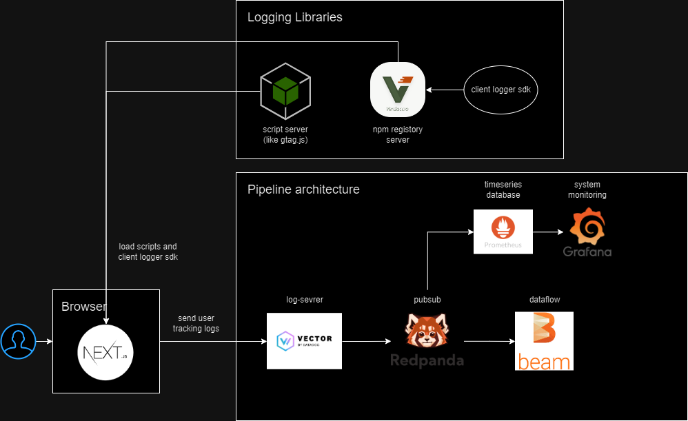

# This is WIP project

## what is this repository?

- An example of Real-time user monitoring system (RUM) like GA4 or Datadog RUM.

## Why?

- I designed an real-time user monitoring system in my job, so I want to build same minimum RUM system that works in my local computure.
- To forcus on my understanding, I use oss tools and docker containers, but not using some cloud managed services (We should use managed services in business use).

## Architectures

### Client Scripts

Client scripts for RUM (working on browser here) are often build in two layers, data transfer layer and user interface & data extraction layer.

The data transfer layer manages the network interactions with backend log server, such as;

- sending logs
- buffering logs
- retry process

The another layer is focusing on user interfaces and data extractions, such as;

- configuration and setup
- some helper methods based on event listeners (for browser)
- extracting informations and transform into log body.

[`DataDog/browser-sdk`](https://github.com/DataDog/browser-sdk) is an good example in the real world. This library provide user interfaces and build log bodies from user inputs. The data transfer layer is separated into another script that is loaded when the sdk is initialized.

### Pipeline Architecture

There are several components here.

- Log server: The endpoint to send logs. This component also works as log aggregator and extract more additional information (such as geolocation from ip addresses or parse user agent string), then proxy logs to PubSub.
- PubSub: This component queues logs from publisher and deliver to comsumers with high scalability, performance and availability. In this archtecture, there is one comsumer (Apache beam).
- Dataflow: This component process log data streamed by pubsub.
- Grafana&Prometheus: This component are used for system monitoring and visualization. In my example, I'll compare two serialize format (JSON and Avro).
